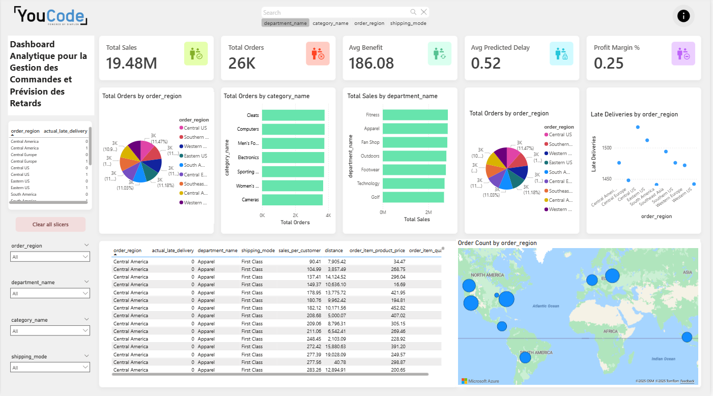

# Dashboard Logistique et Prédiction des Retards – DataCo Global

## Contexte du projet
En tant que développeur en intelligence artificielle au sein de **DataCo Global**, ma mission consiste à superviser et optimiser en quasi temps réel les flux logistiques et la gestion des stocks.  
Le projet intègre des outils analytiques avancés et des modèles prédictifs basés sur l’IA pour prévoir les **retards de livraison** et les **ruptures de stock**, offrant ainsi une vision complète, proactive et intelligente de la chaîne logistique.

---

## Architecture du projet

### 1. Traitement Batch (PySpark / MLlib)
- **Chargement et préparation des données** : Importation, nettoyage et transformation des données pour assurer une qualité optimale.  
- **Analyse exploratoire des données (EDA)** : Visualisation et statistiques pour identifier tendances, corrélations et anomalies.  
- **Prétraitement des données** : Gestion des valeurs manquantes, encodage des variables catégorielles, normalisation des features numériques et équilibrage des classes.  
- **Construction du pipeline ML** : Pipeline MLlib intégrant prétraitement, sélection de features et entraînement des modèles de classification.  
- **Évaluation et comparaison des modèles** : Utilisation de métriques comme l’accuracy, précision, recall, F1-score et courbe ROC avec cross-validation.  
- **Sauvegarde et déploiement du modèle** : Persistance du modèle et intégration dans une application **Streamlit**.

### 2. Spark Streaming
- Lecture des données depuis l’API **FastAPI** via un **bridge TCP**.  
- Application du modèle entraîné sur les flux de données en temps réel pour générer des prédictions.  
- Agrégation des données pour générer des insights (moyennes, totaux, regroupements).  
- Stockage des résultats dans **PostgreSQL** (données transformées) et **MongoDB** (résultats destinés à la visualisation).

### 3. API et Streaming
- Développement d’une API **FastAPI** générant des données aléatoires similaires au dataset.  
- Transmission des données via **WebSocket** puis **socket TCP** pour Spark Streaming.  
- Transformation et traitement en temps réel avec **Spark Structured Streaming**, en utilisant le concept de **fenêtres (windowing)**.

### 4. Visualisation et Dashboard
- Création de dashboards interactifs avec **Streamlit**.  
- Visualisation des données agrégées stockées dans MongoDB.  
- Graphiques interactifs pour analyser :  
  - Nombre de commandes  
  - Ventes par région et catégorie  
  - Retards de livraison  
  - Prédictions vs réel  

---

### 5. Orchestration et automatisation
- Automatisation complète du pipeline avec **Airflow**.  
- Définition d’un **DAG** pour orchestrer :  
  - Récupération des données  
  - Transformations  
  - Prédictions en temps réel  
  - Stockage dans PostgreSQL et MongoDB  
  - Visualisation dans Streamlit  

---

## Technologies utilisées
- **Python** (pandas, numpy, PySpark, MLlib, Streamlit)  
- **FastAPI** (API & WebSocket)  
- **Spark Structured Streaming**  
- **PostgreSQL & MongoDB**  
- **Airflow** (orchestration du pipeline)  
- **Power BI** (tableaux de bord interactifs)

---

## Objectifs principaux
- Superviser et analyser les flux logistiques en quasi temps réel.  
- Prévoir les retards de livraison et ruptures de stock.  
- Offrir un dashboard interactif pour la **prise de décision proactive**.  
- Automatiser l’ensemble du pipeline avec Airflow.
